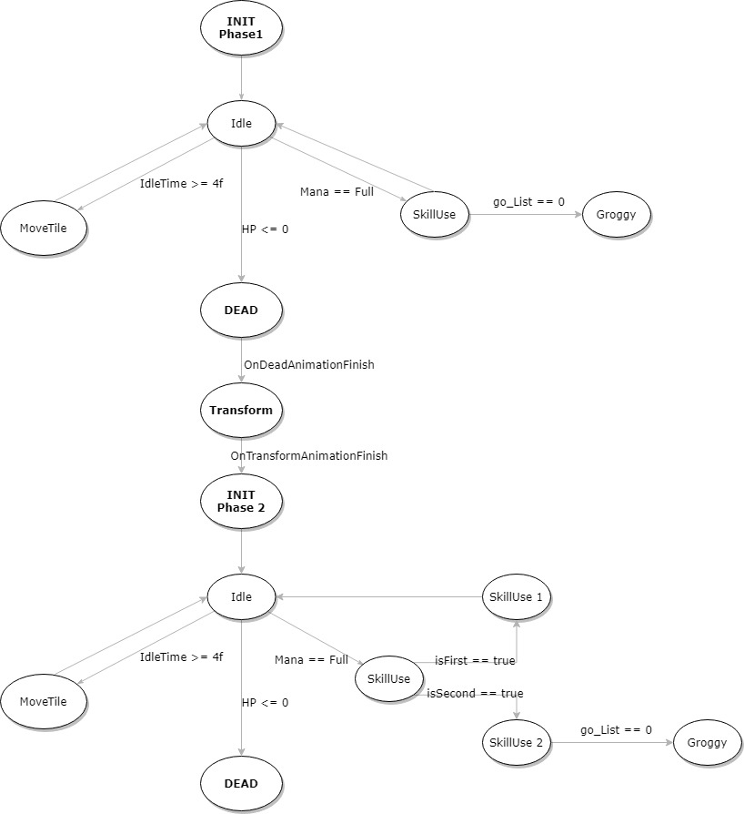
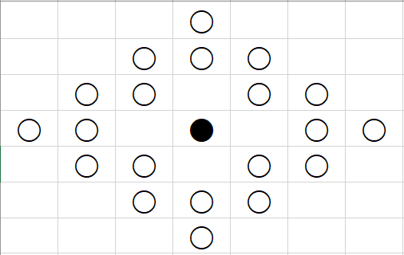
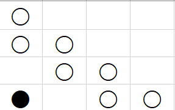
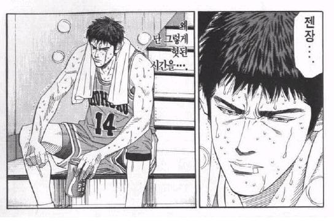

# < 개발 일지 >
---------------------------------------------

# <Development Complete!!>

(6월 28일) 포트폴리오의 개발을 끝마침.

---------------------------------------------

## 확인된 버그 & 개선이 필요한 것


**<지속적인 확인 요망>**

* (확인중) 데드락 발생 시 셔플이 너무 자주되는 현상을 수정할 것 

> 어렵다. 집중적으로 검토할 필요가 있음.


## 추후 추가하고 싶은 것.


- 각성기 구현 - 2차각성기 , 진 각성기

각성기 게이지가 차게 되면 각성이 버튼이 활성화됩니다. (키보드 5번)
각성기를 시전하면 랜덤한 타일 8개가 순서대로 빛이 감돌며 빛이 중앙에 모이는 이펙트가 생성됩니다.
잠시 뒤에 이 이펙트가 터지면, 해당되는 타일이 한꺼번에 터지게 되며, 
터진 타일을 중심으로 가로, 세로의 모든 타일들이 파괴됩니다.
이후 바로 타일을 리필하는 함수를 실행합니다.
이 스킬은 다른 스킬과 똑같이 상대방이 특수한 행동중일때는 사용할 수 없습니다.


-------------------------------------------------------------------
## Last Update


## 2021.06.28 (월)

영상 편집을 마치고 강사님께 평가를 받았다.
효과는 굉장했다!!!

오늘 부로 첫 게임 포트폴리오 개발을 최종적으로 마친다.
정말 고생했다..
추후에 시간이 남는다면, 아직 남아있는 버그와 추가적으로 집어넣고 싶은 컨텐츠를 개발하도록 하겠다.

고생하셨습니다.

---------------------------------------------

### 개발 플로우 차트

개발 FlowChart

1. ♥ 게임 시작시 게임 보드 실행
2. ♥ 게임 보드 안에 Tile들이 랜덤하게 배치
	* Tile들은 [i,j]값을 가지는 배열로 배치된다.
	* Tile들은 여러개의 고유한 ImagePrefab을 가진다.

3. ♥ Nodepiece들을 이동시키는 함수를 구현한다.
	* 마우스 입력을 받아 실행 - 이벤트 핸들러를 추가하여
	* Tile을 클릭 시, 이미지 가장자리에 테두리를 그려 클릭이 되었다는 것을 확인시킨다.
	* 클릭상태에서 다른 인접한 노드를 클릭할 경우, 서로의 위치를 바꾼다.

4. ♥ Tile들이 연결 조건을 만족시켰을 경우를 검사한다.
	* 1x3 을 만들었을 경우?
	* 2x2 를 만들었을 경우?
	* 그외 라인들이 겹치는 특수한 경우들은 어떻게 처리할 것인가?

5. ♥ 연결조건을 만족시키면, 해당 Tile의 sprite를 없애고 빈 자리를 채운다.
	* 빈 자리를 채울 때 랜덤하게 어떤 방식으로 채울 것인가?

6. ♥ 연속으로 Tile의 sprite가 만족되어 파괴되는 횟수를 세어 콤보시스템을 만든다

7. ♥ 점수가 지속적으로 유지되며 더해지게 만든다.
	* 획득한 콤보에 따라 추가 점수를 얻을 수 있게끔 구현
	* 한번에 파괴되는 Tile의 sprite 갯수가 많을 수록 

8. ♥ 제한시간을 추가하고, 제한시간이 끝나면 게임이 종료하도록 만든다.

9. ♥ 스킬 게이지를 추가하고, 스킬 아이콘을 만들자.
	* 스킬 게이지는 Tile을 맞출 수록 게이지가 차오른다.
	* 스킬을 사용 시, 일정 게이지를 소모하고 특수 효과를 사용할 수 있다.

10. ♥ 각 스킬들의 특수 효과들을 구현한다.
	* 스킬의 동작 베이스는 윗부분을 참고
	* 작업량이 많고 여러 함수들을 구현해야할듯
	* 액티브, 패시브 스킬들을 만들고, 각각 레벨에 따라 효과가 조금씩 달라지도록 구현
	※ 가장 어려운 부분이 아닐까 생각 

11. ♥ AI와 대전하는 모드를 만든다
	* AI의 동작을 어떻게 구현할 것인가?
	* 정확도? 빈도?
	* AI도 일정 시간이 지나면 특수 스킬을 사용
	* 그러나 너무 터무니없는 기능이 아니도록

12. (SKIP) 여러 스테이지를 만든다.
	* 여러 상대와 싸울 수 있는 스테이지를 만든다.
	* 연속 전투 기능 / 스테이지 선택으로 구현할 계획

13. ♥ 스테이지 시작 시 연출을 만든다.
	* 대전 게임을 하는 듯 한 시작 연출
	* 시작 전 레디, 스타트를 해주는 신호를 추가

14. ♥ 게임 결과화면을 만든다.
	* 점수, 시간 등 몇가지 기준을 잡아 랭크 시스템을 만들어 보여준다.
	* 위의 각 최고 기록들이 보관되도록 만든다.(playerPref을 임시로 사용)

15. ♥ 일시정지 메뉴를 만든다.
	* 일시정지시에 시간이 멈추도록 한다.
	* 사용자의 동작을 제한시킨다.
	* 메뉴로 가기, 돌아가기 기능을 넣는다.

16. ♥ 타이틀 씬과 로딩 씬을 구현한다.
	* 비동기식 실행으로 구현
	* 로딩 씬에는 랜덤하게 팁 문구 및 사진이 나오도록

17. ♥ 메뉴 씬에서는 NPC가 배치되어있으며, NPC와의 대화를 통해 스킬레벨을 올리거나 게임 설정을 하는 등 \
	  여러 기능을 이용할 수 있음.
	* 입장할 던전에 대한 설명이 나옴.

18. ♥ 외부에서 이미지를 가져와 스프라이트를 덧씌운다.
	* Aseprite - 픽셀아트툴을 이용하여 여러 도트들을 찍을 계획.
	* Piskel 무료 아트툴을 추천받았음.

19. ♥ 외부에서 배경음, 효과음을 가져와 적용한다.

20. ♥ 게임 연출 부분을 개선한다.

21. ♥ 프로토타입을 배포하고 피드백을 받는다.

--------------------------------------------------

### 이전 개발 일지

### 2021.06.27 (일)

1. 영상 촬영

	1. 인트로 및 마을 대화 및 기능
	2. 인게임 플레이
		1. 타일 매칭V
			1. 콤보 실패 V
		2. 스킬 사용
			1. 1,2,3,4 스킬
			2. 스킬 쿨타임 표시
		3. 데드락
		4. 데바스타르 1스킬
			1. 파훼 성공V
			2. 파훼 실패 - 광폭화V
		5. 데바스타르 변신V
		6. 데바스타르 2스킬
			1. 파훼 성공V
			2. 파훼 실패 - 광폭화 V
		7. 데바스타르 3스킬
			1. 파훼 성공 및 임무 성공 V
			2. 파훼 실패 및 임무 실패V


	총 영상 길이를 3 ~ 4분 내외로 편집


### 2021.06.25 (금)

1. 최종 테스트 - 2차 프로토타입 피드백

	* 메모리 점유율 확인 - 문제없음.
	* 플레이 영상 촬영

2. 버그 확인 - 버그 시점을 특정잡기가 힘들어서 보류.

	* CancelDevaSkill1 에서 nullReferenceException 출력중 - null을 조사하는 조건문 추가 
	* 데드락 연속 발생
	* 데바스타르 2페이즈 스킬 동작 순서


### 2021.06.24 (목)

1. 프로토타입 피드백 수정 - 버그

	심각도에 따라, 그리고 간단한 것 부터 해결하는 방향으로 해결하기

<버그>

* **(확인중) 가끔씩 PlayerState가 WAIT에서 멈추는 버그**

	왜 이런 일이 생기는지 발생 시점을 아직 알수가 없다. 지속적인 확인이 필요하다.
	임시적으로 타일 이동 이후 PlayerState.Move로 바뀌도록 추가.

	- 게임 상태가 Playing으로 바뀌어 시작하자 마자 WAIT으로 바뀌었음

* **(확인중) 데드락 발생 시 셔플이 너무 자주되는 현상을 수정할 것**


2. 프로토타입 피드백 수정 - 개선

	* (완료) 튜토리얼 및 팁 관련 컨텐츠가 있었으면 좋겠음.

	> 게임을 처음 시작할 경우, 한번만 보여주게끔 변경. 또한 로딩 화면에서 일부 팁을 알려주는 텍스트 추가


3. (완료) 추가 기능 구현

	* 점수 시스템을 구현

	ScoreManager에 추가적으로 구현해보기.

	SSS : 15만
	SS : 10만
	S : 7만
	A : 5.5만
	B : 4만
	C : 2.5만
	D : 1.5만
	E : 0.5만


4. (진행중) 빌드 후 개선할 점 찾기

	1. (완료) 타일을 클릭했는지 구별이 가능한 이미지가 나오면 좋겠다(피드백 의견)

	기본 마우스 이미지를 Edit - ProjectSetting - Player에서 바꿔주었다.
	마우스 커서 이미지를 바꿔서 구별이 가능하게끔 해보자.
	마우스 버튼 눌렀을 때, 떼었을 때 커서 이미지를 변경하게끔 만들었다.


	2. (완료) NPC 대사를 조금 수정하고, 다이얼로그 텍스트 캔버스 클릭시 소리 출력 수정
	3. (완료) 스킬 아이콘 스프라이트 해상도 늘리기
	4. (완료) 스킬 설정 창에서, 속성값 텍스트의 색상을 변경
	5. (완료) 쇼타임 패시브를 개편하고, 패시브 스킬들의 속성값을 스킬 설정창에 표기
	6. (완료) AlertText가 너무 구석진 곳에 있어 알아보기 힘듦.
	7. (진행중) 배경음악, 효과음 등 볼륨을 직접 듣고 확인하여 데시벨을 조절
		
		* 인게임 배경음악 데시벨 줄이기
		*	실드 생성, 회피 데시벨 높히기

	8. (완료) 스킬 아이콘을 누르면 스킬이 사용되도록 설정


### 2021.06.23 (수)

1. 프로토타입 피드백 수정 - 버그

	심각도에 따라, 그리고 간단한 것 부터 해결하는 방향으로 해결하기

<버그>

* (확인중) 죽었을 때에도 베스트타임을 갱신하는 문제

> 죽었을 때에는 최고기록을 갱신하지 않도록 따로 제어를 걸어주지 않았다.

	
* **(완료) 해상도에 따라 타일 크기가 올바르게 바뀌지 않는 버그**

> 이전에 확인했었던 버그. 타일 생성 시, 화면 크기에 맞게 타일의 사이즈를 재조정하지 않았기 때문에 생기는 버그라고 생각
	 (완료) 또한 게임중에는 해상도 변경이 불가능하도록 설정해야겠다.
	 
	 변경해야하는 것들
	 1. (완료) 타일 사이즈 / 백타일 사이즈
	 2. (완료) 타일 이미지 크기 / 백타일 이미지 크기
	 3. (확인중) 여러 기타 프리팹들
	 		넨가드 프리팹, 타일 매칭 프리팹, 타일 폭발 프리팹
	 4. (확인중) 파티클

하면서 알게 된 사실이 있는데, 해상도를 변경하면 Canvas의 Scale이 가로, 세로 따로 변하는 것이 아닌 모든 비율이 일정하게 증가되는 것을 확인하였다. 왜일까?

> GameManager에 해상도가 바뀔때마다 변화되는 Scale값을 따로 참조할수 있는 변수를 만들었다. (ResolutionScale)\
  이 변수는 해상도가 바뀔 때 마다 자동으로 Scale값이 세팅된다.\
  빌드한 이후에도 잘 바뀌에서 적용되는지 확인할 것.\
  프리팹들은 생성하고 SetParent를 하면, 알아서 크기가 잘 조정되는 듯 하다.


* (완료) 타일을 연속으로 두번 옮길 수 있는 버그

> 속성을 하나 만들어서 타일을 한번 옮기면 속성값을 변환. 속성값에 따라 플레이어의 currentState를 제어하도록 추가

* (완료) 광폭화중에 데미지가 들어가지 않게 수정.

* (완료) 일시 정지 중 마을로 가기 버튼을 클릭했을 때, 로딩이 제대로 이루어지지 않는 버그

	1. 코루틴이 계속 동작되어 코드가 꼬여버린 경우를 생각할 수 있음.

	  StopAllCoroutine을 했지만 해결되지 않음?
	 	선언 순서를 다르게 하니까 Fade 문제를 해결하였다.

	2. 인스턴스들에 따로 null로 초기화하지 않아서 제대로 동작하지 않는 경우도 생각할 수 있음.

	  BoardManager,BoardManagerMonster,SkillManager를 null로 초기화를 하였다.

* **(확인중) 가끔씩 간헐적으로 PlayerState가 WAIT에서 멈추는 버그**

	왜 이런 일이 생기는지 발생 시점을 아직 알수가 없다. 지속적인 확인이 필요하다.
	임시적으로 타일 이동 이후 PlayerState.Move로 바뀌도록 추가.

+ 외곽에서 타일이 매칭이 될 경우, 인접한 봉인된 타일이 파괴되지 않음.

	인덱스를 체크하는 함수가 잘못 정의되어있었다. 제대로 수정.


2. 프로토타입 피드백 수정 - 개선

	* 배경음악, 효과음 등 볼륨을 조절할 필요가 있음
	* 튜토리얼 및 팁 관련 컨텐츠가 있었으면 좋겠음.
	* (완료) 데바스타르 사망 시 이펙트 연출

	> 별이 폭발하는 듯한 파티클을 사용하자

	* (완료) 결과화면, 일시정지 화면 개선


3. (보류) 추가 기능 구현

	* 점수 시스템을 구현

	ScoreManager에 추가적으로 구현해보기.


### 2021.06.22 (화)

1. 프로토타입 피드백 수정

	심각도에 따라, 그리고 간단한 것 부터 해결하는 방향으로 해결하기

	<버그>

	
	* (확인중) 죽었을 때에도 베스트타임을 갱신하는 문제

	> 죽었을 때에는 최고기록을 갱신하지 않도록 따로 제어를 걸어주지 않았다.

	* (완료) 승리 했는데도 패배 화면이 출력되는 버그

	> 위의 State의 흐름을 파악할 필요가 있는 듯 하다. ONGUI를 확인해보기.

	보드매니저의 상태로 검사를 하니 제대로 상태 변화가 이루어지지 않아 올바른 실행이 되지 않았음
	따로 게임매니저에서 관리하는 PlayerState를 만들고 Win과 Lose 상태만을 받아 검사하도록 설정

	* (완료) 마을로 돌아간 뒤에 다시 시작했을 때, 타일이 지멋대로 움직이는 버그

	> GameState, PlayerState, MonsterState의 변화를 체크해야할 필요가 있을 듯 하다.\
	- OnGUI를 통해 확인해보기

	MonsterAI의 Move 함수에서 GameState가 Playing중일때만 동작하도록 설정하여 함부로 동작하는 것을 막았다.

	* **(진행중) 해상도에 따라 타일 크기가 올바르게 바뀌지 않는 버그**

	> 이전에 확인했었던 버그. 타일 생성 시, 화면 크기에 맞게 타일의 사이즈를 재조정하지 않았기 때문에 생기는 버그라고 생각
	 (완료) 또한 게임중에는 해상도 변경이 불가능하도록 설정해야겠다.
	 
	 변경해야하는 것들
	 1. (완료) 타일 사이즈 / 백타일 사이즈
	 2. (완료) 타일 이미지 크기 / 백타일 이미지 크기
	 3. (확인중) 여러 기타 프리팹들
	 		넨가드 프리팹, 타일 매칭 프리팹, 타일 폭발 프리팹
	 4. 파티클..

	 하면서 알게 된 사실이 있는데, 해상도를 변경하면 Canvas의 Scale이 가로, 세로 따로 변하는 것이 아닌 모든 비율이 일정하게 증가되는 것을 확인하였다. 왜일까?


	* (완료) 묶는 스킬을 썼을 때, 묶는 타일이 가끔씩 이동하는 버그
	> 이전에 확인했었던 버그. 마우스 드래그 거리를 따로 제한시켜두지 않아 생긴 버그인 듯 하다.

	거리를 따로 계산하는 것이 아니라, 옮길 타일의 속성을 검사하는 것이 훨씬 간편할듯 하다.
	SwapTile 부분에 옮겨질 타일 대상이 봉인된 상태라면 옮겨지지 않는 방식으로 구현

	* **타일을 연속으로 두번 옮길 수 있는 버그**
	> 속성을 하나 만들어서 타일을 한번 옮기면 속성값을 변환. 속성값에 따라 플레이어의 currentState를 제어하도록 추가

	* 광폭화중에 데미지가 들어가지 않게 수정.

	<개선점>

	* 배경음악, 효과음 등 볼륨을 조절할 필요가 있음
	* 튜토리얼 및 팁 관련 컨텐츠가 있었으면 좋겠음.
	* (완료) 2페이즈 시작 시 불길을 보드 뒤쪽에 생성되게 바꿈.


### 2021.06.21 (월)

<<<<프로토타입 배포하기>>>>

1. 결과화면 창 개선 및 꾸미기

  * 데바스타르 사망 연출
  * 플레이어 승리, 사망 시 UI Sprite 출력
	* 마을로 가기 버튼 만들기
	* 랭크 시스템 개선


2. 플레이어 및 몬스터 스킬 효과음 추가

	* 플레이어
	1. 체인플로레
	2. 변이 파리채
	3. 잭프로스트
	4. 반중력 기동장치(데드락 셔플)

	* 데바스타르

	1. 1스킬
	2. 1스킬 광폭
	3. 1스킬 그로기
	4. 2스킬
	5. 2스킬 광폭
	6. 3스킬 
	7. 3스킬 그로기
	8. 3스킬 광폭

	* 기타
	1. 인게임 시작시 카메라 이동시 효과음


3. 버그 수정 및 개선

  * (완료) 데바 1스킬 광폭 코딩안함
	* (완료) 변이파리채 소리이벤트 안넣었음
	* (완료) 데드락 효과음 안넣었음
	* (완료) 결과화면 점수에 콤마가 들어가도록 수정
	* (완료) 결과화면 텍스트들이 좀 더 잘 보이도록 백그라운드를 추가

	* (완료) 사운드 볼륨 조절

	> 타일 클릭시, 타일 파괴시 기본 음량을 살짝 낮게 조절

4. 프로토타입 배포 - 깃허브 릴리즈 - 

 UBC 팀 멤버 4명에게 테스트
 (벡스터,종이구슬,나하트엘,하루)


5. 프로토타입 피드백 

	<버그>

	* 묶는 스킬을 썼을 때, 묶는 타일이 가끔씩 이동하는 버그
	* 해상도에 따라 타일 크기가 올바르게 바뀌지 않는 버그
	* 승리 했는데도 패배 화면이 출력되는 버그
	* 죽었을 때에도 베스트타임을 갱신하는 문제
	* 마을로 돌아간 뒤에 다시 시작했을 때, 타일이 지멋대로 움직이는 버그

	<개선점>

	* 배경음악, 효과음 등 볼륨을 조절할 필요가 있음
	* 튜토리얼 및 팁 관련 컨텐츠가 있었으면 좋겠음.
	* 2페이즈 시작 시 불길을 보드 뒤쪽에 생성되게 바꿨으면 좋겠음.


### 2021.06.20 (일)

1. (확인중) 데드락 발생 시 셔플이 너무 자주되는 현상을 개선

2. 결과화면 창을 재조정 및 디자인 재구성

### 2021.06.19 (토)

1. (확인중) 데드락 발생 시 셔플이 너무 자주되는 현상을 개선


### 2021.06.18 (금)

1. (완료) 플레이어 3스킬 잭프로스트 빙수 추가

	몬스터의 움직임을 일정시간동안 멈추게 하는 스킬입니다.
	데바스타르가 스킬을 사용중에는 사용 불가.

	데바스타르의 State에 따라서 다르게 처리를 해야할 듯 싶다.

	데바스타르가 Move 상태일 경우에는 elapsedTime을 멈추게한다.
	데바스타르가 UseSkill 상태일 경우에는 사용할 수 없다. => 모든 스킬에 공통적으로 해당, 해당 스크립트를 봐야할듯
	데바스타르가 스킬 시전중일 경우에는 남은 시간을 멈추게 한다.
	데바스타르가 그로기 중일 경우에는 사용할 수 없다. (그로기 상태일 때 써봐야 별로 효과가 없을 것 같다. 를 출력)


2. (완료) 플레이어 스킬 이펙트 적용

	1. (완료) 체인플로레
		고매미가 등장하면서 빠르게 왔다갔다하며 애니메이션이 끝날 쯤에 파티클이 생성
		(CartoonFx 28번 ElectricField 1)

	2. (완료) 변이파리채
		거대한 파리채가 내려친다. 내려칠 타이밍에 파티클이 생성되고, 타일이 바뀌게 된다.
		(CartoonFx 45번 Magic Poof) ==> TODO
		재생속도 조금 빠르게


	3. (완료) 잭프로스트 빙수
		데바스타르 보드에 얼음이 생김
		얼음이 부셔질 때 생기는 스프라이트도 있었으면 좋겠음


	4. (완료) 잭오 할로윈
		해당되는 잭오할로윈에 불꽃 이펙트가 생기며 지속적으로 불 파티클이 생성됨
		생성된다는 느낌의 파티클도 있었으면 좋겠다.
		(Impact Glowing Cross HDR)


3. (진행중) 플레이어 보이스 적용

- 플레이어 보이스 출력을 따로 정리하고 관리하는 클래스를 생성해야겠다.

**<플레이어 목소리 목록 구성>**

* (진행중) 타일 클릭 시 사운드
	- 잭오랜턴,플로레,플루토,잭프로스트,기타

	> 타일 파괴 시 사운드가 중첩되어 들리게 할 것인가? NO!

* 캐릭터 사운드
	- (완료) 스킬 사용

		1번스킬, 2번스킬, 3번스킬, 4번스킬

	- (완료) 마나부족

	- 승리 목소리
	- 사망 목소리

* 스킬 효과음 사운드
  - 1번 스킬
  - 2번 스킬
  - 3번 스킬
  - 4번 스킬


4. 버그 수정 및 개선

  * (보류) 타일을 연속으로 드래그해서 연속으로 옮길 수 있는 현상
  * 스테이지 입장 배경이미지 바꾸는 것을 고려해보기?
  * (확인중) 데바스타르 2스킬을 2번 연속으로 쓰는 현상

  * 봉인된 이후 옮길 수 있는 타일이 없을 때, 셔플이 안되는 경우 

  > 옮길 타일 뿐만 아니라 옮겨진 이후 매칭을 고려할 타일들까지 검사할 필요가 있다.
 	  근데 이걸 꼭 개선해야할까?

 	* (완료) 힌트 이펙트가 이미 생성중인데, 마나가 소모되는 현상을 수정

 	* (완료) 플레이어 데미지 조절

 	* (완료) 2페이즈 시작 시, 불 이펙트 파티클이 조금 느리게 생성되도록 처리

 	* (완료) 파리채 애니메이션 이펙트가 제대로 출력되지 않는 현상을 수정


### 2021.06.17 (목)

0. (진행중) 플레이어 3스킬 잭프로스트 빙수 아이디어

	몬스터의 움직임을 일정시간동안 멈추게 하는 스킬입니다.
	데바스타르가 스킬을 사용중에는 사용 불가.

	데바스타르의 State에 따라서 다르게 처리를 해야할 듯 싶다.

	데바스타르가 Move 상태일 경우에는 elapsedTime을 멈추게한다.
	데바스타르가 UseSkill 상태일 경우에는 사용할 수 없다. => 모든 스킬에 공통적으로 해당, 해당 스크립트를 봐야할듯
	데바스타르가 스킬 시전중일 경우에는 남은 시간을 멈추게 한다.
	데바스타르가 그로기 중일 경우에는 사용할 수 없다. (그로기 상태일 때 써봐야 별로 효과가 없을 것 같다. 를 출력)


1. (완료) 데바스타르 스킬 연출 개선

	* (완료) 스킬3 거짓된 영웅들이여

		1. 보드 한 가운데에 블랙홀 스프라이트가 패턴 파훼 시간동안 Loop상태로 애니메이팅한다.
		2. (오류 발생) 플레이어가 패턴 파훼에 성공할 경우, Fail 트리거가 발생하여 그대로 FadeOut된다. 
		3. 플레이어가 패턴 파훼에 실패할 경우, Berserk 트리거가 발생한다.
 
	* (완료) 스킬3 버서크 (카오스 퓨전)

		1. 최대한 스프라이트를 짜집기해서 비슷하게 구현
		2. 각 타이밍에 맞게 Animation Event를 등록하여 사운드 출력과 플레이어 데미지 계산을 처리하였다.


2. (진행중) 플레이어 스킬 이펙트 추출 및 적용

	1. (완료) 체인플로레
		고매미가 등장하면서 빠르게 왔다갔다하며 애니메이션이 끝날 쯤에 파티클이 생성
		(CartoonFx 28번 ElectricField 1)

	2. (완료) 변이파리채
		거대한 파리채가 내려친다. 내려칠 타이밍에 파티클이 생성되고, 타일이 바뀌게 된다.
		(CartoonFx 45번 Magic Poof) ==> TODO

	3. (보류) 잭프로스트 빙수
		데바스타르 보드에 얼음이 생김
		얼음이 부셔질 때 생기는 스프라이트도 있었으면 좋겠음

	4. (보류) 잭오 할로윈
		해당되는 잭오할로윈에 불꽃 이펙트가 생기며 지속적으로 불 파티클이 생성됨


3. 플레이어 상태 추가 및 개선

PlayerState에 USESKILL enum 타입 추가.
스킬 애니메이션을 관리하는 SkillEffectManager 컴포넌트를 생성하여, 애니메이션의 시간에 따라
Event를 발생시키고 그에 맞는 함수를 동작시키도록 작성하였다.


4. 버그 수정 및 개선

  * (완료) 일시정지 화면이 최상위 Order를 가진 Canvas에 렌더링되도록 수정할 것

  > 나중에 결과 화면 창도 이 Canvas 위에 올라갈 것이다.

  * (확인중) 데드락 발생 시 셔플이 너무 자주되는 현상을 수정할 것 => 코루틴으로 수정하여 대기시간을 만들어야할듯
  * (보류) 타일을 연속으로 드래그해서 연속으로 옮길 수 있는 현상
  * 스테이지 입장 배경이미지 바꾸는 것을 고려해보기?
  * (확인중) 데바스타르 2스킬을 2번 연속으로 쓰는 현상


### 2021.06.16 (수)

1. 데바스타르 스킬 연출 개선

	* (진행중) 스킬3 거짓된 영웅들이여
 
	* (진행중) 스킬3 버서크 (카오스 퓨전)


2. 버그 수정 및 개선

  * (완료) 잭 오 할로윈 타일이 매칭 대상으로 처리되는 오류 수정

  * (완료) 데바스타르 2스킬 버서크가 다시 발동이 되지 않음 => 애니메이션 STATE를 Any State에서 하지 않았기 때문임
  * (완료) 2페이즈 시작 이후 3스킬을 먼저 발생하는 현상을 수정
  * (완료) 몬스터가 광폭화 중일 때에도 타일을 조작할 수 있는 현상을 수정

  * (보류) 일시정지 화면 및 결과화면이 최상위 Order를 가진 Canvas에 렌더링되도록 수정할 것
  * (보류) 데드락 발생 시 셔플이 너무 자주되는 현상을 수정할 것 => 코루틴으로 대기시간을 만들어야할듯
  * (보류) 타일을 연속으로 드래그해서 연속으로 옮길 수 있는 현상


### 2021.06.15 (화)


1. 데바스타르 스킬 연출 개선

	* (완료) 스킬2 버서크 (컨빅션)

	양쪽에서 거대한 창이 꽂힌 이후, 번개 이펙트가 발생하며 터지는 듯한 연출


### 2021.06.14 (월)

1. 데바스타르 스킬 연출 개선

	* (완료) 스킬 1(서로를 옮아매는 어리석은 인간들이여)

		마법진의 색깔을 일정 시간을 텀으로 바뀌도록 수정
		일정 시간을 텀으로 마법진이 조금씩 회전하도록(이건 넣어보니 별로라서 뺐음)

	* (완료) 파멸하라

		순식간에 터지는 파티클 이펙트를 발생
		0.5초의 딜레이를 가지고 생성


	2. (완료) 스킬2 (그분을 대신하여)

		* 파괴해야하는 타일에 원형 테두리 파티클 이펙트를 생성하여 적용?\
		  타일 파괴에 성공할 경우 플레이어 보드 전체에 노란색 배리어 이펙트를 생성


3. 간단하게 개선할 수 있는 부분이 있다면 수정해보기

	1. (완료) Ready, Start 텍스트를 좀 더 가독성있게 수정
	2. (완료) 제한시간 텍스트를 소숫점들이 표시가 되지 않도록 수정
	3. (완료) 데바스타르 변신 시, 배경 화면의 색상을 자주색 계통으로 변하도록 수정
	4. (완료) 플레이어가 데미지를 받을 때, 체력 바가 좌우로 핑퐁하며 진한 빨강 색상으로 변하도록 설정
	5. (완료) 패시브 스킬 발동 시, 텍스트가 따로 출력되어 가독성을 높힌다.
	6. (완료) 몬스터가 그로기 상태일 때, 남은 시간을 따로 표시해주는 슬라이더를 추가한다.


4. (완료) 버그 수정

데바스타르 3스킬 그로기 때 무력화 게이지가 제대로 표시되지 않는 버그


### 2021.06.13 (일)


0. 버그 수정

	- 데바스타르가 사망 시 보이스가 출력되지 않는 현상을 수정


1. 플레이어 스킬 이펙트 연출 구성

	1. 체인플로레
		고매미가 등장하면서 빠르게 왔다갔다하며 그 위치로 파티클이 이동

	2. 변이파리채
		거대한 파리채가 내려친다. 내려칠 타이밍에 파티클이 생성되고, 타일이 바뀌게 된다.

	3. 잭프로스트 빙수
		데바스타르 보드에 얼음이 생김
		얼음이 부셔질 때 생기는 스프라이트도 있었으면 좋겠음

	4. 잭오 할로윈
		해당되는 잭오할로윈에 불꽃 이펙트가 생기며 지속적으로 불 파티클이 생성됨

2. 데바스타르 스킬 이펙트 연출 구성

	1. 서로를 옮아매는 어리석은 인간들
		해당되는 타일에 마법진 파티클이 생성되어 위치를 표시
		봉인된 타일 위의 마법진이 지속적으로 반짝였으면 좋겠음

	2. 그분을 대신하여
		해당되는 타일에 노란색 원이 반짝이면서 회전했으면 좋겠음
		노란색 타일을 전부 파괴시키면 플레이어 보드에 노란색 배리어가 생성됨

	3. 컨빅션
		보드 배경 앞부분에 번개 이펙트가 여러개 생성.

	4. 묵시록의 빛이여
		실패했을 때 카오스 퓨전이 발동.


3. 게임 전체 연출 구성

	1. 데바스타르 사망 시, 게임 속도가 살짝 느려지며 데바스타르가 죽었다는 느낌을 던파식으로
	2. 플레이어가 데미지를 받으면, 잠시동안 플레이어의 체력 바가 좌우로 핑퐁하며 빨간색 Color로 덧씌워짐


### 2021.06.11 (금)


1. (완료) SoundManager 개선

변수 이름을 수정하다가 에디터에서 설정한게 다 날아갔다. 미친;;;

위와 같이, 에디터에서 직접 편집하는 것은, 유실 가능성이 매우 크기 때문에,
코드상에서 Resources.Load를 통해 클래스에 집어넣는 방식으로 만드려고 한다.

<대공사>

	(완료)PlaySE - SFX
	(완료)데바스타르 보이스 => 아래에서 정리
	(완료)캐릭터 보이스
	(완료)NPC보이스 
	(완료)배경음악

2. (완료) 데바스타르 목소리를 정리

	- 조우 시 (3개) 
		devastar_meet_

	- 1스킬 (1개) 
		devastar_Human_Skill

	- 1스킬 광폭화 (1개)
		devastar_skill_08_3

	- 변신 (2개)
	  devastar_skill_01_5, (devastar_Human_Death1,devastar_HumanToDevil)

	- 2스킬 (3개) / 2스킬 진행이후 (3개) / 마무리 공격 (1개)
		devastar_devil_skill_08_...

	- 3스킬 (3개)
		devastar_devil_skill_09_1_...

	- 3스킬 광폭화 (2개) / 마무리(1개) / 웃음(2개)
		devastar_devil_skill_09_3_..
		devastar_devil_skill_09_4_..
		devastar_devil_skill_09_5

	- 그로기 (인간 1개, 악마 3개)
	인간 - devastar_skill_02_1
	악마 - devastar_devil_skill_09_2, devastar_devil_groggy_01, devastar_devil_groggy_02

	- 승리 (인간 2개)
	인간 - devastar_skill_01_2, devastar_skill_01_3

	- 사망 (1개)
	devastar_devil_die_01

	- 경직 (인간 1개, 악마 3개)
	인간 - devastar_groggy
	악마 - devastar_devil_dmg_...


3. (완료) 간단하게 수정 가능한 부분이 있으면 수정해보기

+ **가끔씩 매칭이 되어도 파괴가 이루어지지 않는 버그**

> 타일 스피드를 deltaTime으로 바꿨더니 타일 파괴 처리 시간이 부족한듯 하다
그래서 대기시간을 살짝 늘리고, 타일 스피드를 살짝 높혔다.

+ 게임 시작시 VS Text를 회전하면서 등장하도록 변경

+ 가끔씩 포인터 대상의 게임 오브젝트에서 컴포넌트를 null값으로 반환하는 오류가 생겨\
 UtilHelper Class에 HasComponent를 추가하였다.


4. 플레이어 목소리 목록 구성

* 타일 클릭 시 사운드
	- 잭오랜턴,플로레,플루토,잭프로스트,기타

* 스킬 효과음 사운드
  - 1번 스킬
  - 2번 스킬
  - 3번 스킬
  - 4번 스킬

* 캐릭터 사운드
	- 스킬 사용

		1번스킬, 2번스킬, 3번스킬, 4번스킬

	- 마나부족

	- 승리 목소리
	- 사망 목소리


### 2021.06.10 (목)


1. (완료) 메뉴 씬까지 검토하고, 수정 가능한 부분이 있으면 수정해보기

  - (완료) 팝업 메뉴 열기 및 클릭 효과음을 교체 -> CommandClick
	- (완료) 레벨업 버튼 클릭 시, 효과음이 나오도록 추가
	- (완료) 레벨업 버튼 클릭 시, 레벨업 파티클이 나오도록 추가
	- (완료) 레벨업을 더이상 하지 못하면 효과음과 파티클이 나오지 않도록 수정
	- (완료) 파티클의 텍스처의 이미지를 별 모양으로, 무지개색상으로 나타나게

	파티클을 설정할 때, 파티클에 쓰이는 텍스처의 타입을 확인해보는 것이 중요한것 같다.
	일반적으로 Material Shader는 Mobile의 Additive가 잘 적용되는것 같고
	Texture Type은 Default로 바꿔주니 아주 적용이 잘 된다.


2. (완료) 게임 씬 연출 추가

<게임 시작 연출>

	- 처음 씬이 시작될 때, 검은 화면이 FadeOut 되면서 카잔의 관이 클로즈업 되어있는 상태임
	- 이후 카메라 시점이 화면 전체로 이동되면서, 플레이어와 몬스터의 대결 프레임이 실행
	- 대결 프레임 애니메이션 실행 완료 후, 이전에 만든 애니메이션과 연결되어 진행

Versus 사용 효과음 - guild pvp request, prey_thunder


- (완료) 2페이즈 시작시 생성되는 불꽃 파티클을 화면 테두리에 생성되도록 변경

> 각 가장자리마다 불꽃 만들어보니까 안이쁘고 정신사납다. 그냥 아래쪽에만 생성되도록 수정


3. Bug Fix

- (완료) 데드락이 가끔씩 연속되어 반복되는 현상을 개선
- (완료) 데바스타르 변신에 딜레이가 생기는 현상을 수정
- (완료) 게임 클리어시, 보드매니저를 null로 바꾸는 부분을 개선

> 플레이어 동작 대기 조건을 수정


### 2021.06.09 (수)


1. 메뉴 씬까지 검토하고, 수정 가능한 부분이 있으면 수정해보기

	- 환경설정 Dropdown Label 이미지 전부 수정 (안되네?)
	- (완료) 각각의 NPC와 처음 대화할 때, 처음 대화 시의 대사가 제각각 나오도록 처리
	- (완료) 스킬창을 끄고 다시 열었을 때, 스킬 선택 금색 테두리가 남아있는 부분
	- (완료) 스킬 관리창 닫을 때, 이키 목소리가 출력이 안되는 현상
	- (완료) 메인 메뉴 씬에서 Esc 키를 누르면 게임 종료 팝업창이 나타나도록 기능
	- (완료) 게임 씬에서 타일의 속도가 너무 빠른 현상을 수정 -> deltaTime 값을 이용하여 수정
	- 레벨업 버튼 클릭 시, 효과음이 나오도록 추가
	- 레벨업 버튼 클릭 시, 레벨업 파티클이 나오도록 추가


2. **게임을 빌드하고 실행하면, JSON파일이 생성되지 않는 버그를 해결**

Json.Net에서 지원하는 함수에는 문제가 없었다. 다만, **빌드 이후 지원하는 C# 버전이 2.0으로 낮은 버전으로 빌드가 되어 함수가 동작하지 않았던 것이다!!**

Project Settings - Player에서 Api Compatibility Level을 .NET 4.x 버전으로 바꿔서 빌드해주니 잘 된다!!!!


### 2021.06.08 (화)

1. (완료) 소형 메뉴판이 열려있는 상태에서, 소형 메뉴판 버튼을 클릭하지 않고 다른 곳을 클릭하면 메뉴판이 닫히는 기능을 넣기

- 만약 팝업창이 열려있는 상태에서, 다른 오브젝트를 클릭하면 닫히게 끔 해야하나?

2. (완료) 텍스트 수정하기

TextProMesh로 한글 폰트를 직접 만들려고 하니, 이미지가 뭉개지고 이뻐보이지 않음
따라서 포토샵에서 따로 작업하여 만들어진 이미지를 가져와 사용할 것이다.

3. (완료) 음원 추출 및 적용

- 타이틀 배경음 및 시작음 (origin)
- 버튼 효과음 및 스킬 레벨업 효과음 (click / minikingdom)
- 대화 클릭 시 효과음 (clickButton)
- 게임 시작 효과음 (oz_ui_count / sr_ui_start)

4. (완료) NPC 방치 대화 출력 조절

5. (완료) 타이틀 씬에서 네오플, 던파 로고 및 포폴 텍스트를 FadeOut하는 화면을 설정

6. 버그 수정

 1. (완료) 제한시간 폰트 Shader 굵기 수정
 2. (완료) 게임시작 확인 팝업창 이미지 개선
 3. (완료) 변이 파리채 쿨타임, 마나소모량 수정


+ **게임을 빌드하고 실행하면, JSON파일이 생성되지 않는 버그**

도대체 왜이러는가?

<조사하면서 알게 된 부분> 

1. Application.streamingAssetsPath을 써서 StreamingAsset 폴더를 생성하고 데이터를 받아올 수는 있지만,
읽기 전용 폴더이기 때문에 쓰기가 불가능하다.
2. Application.persistentDataPath을 사용하면 Window의 경우 C:\Users\사용자\AppData\LocalLow\DefaultCompany 에 저장된다. 이런 경우에도 Editor는 위의 경로를 통해 데이터를 문제없이 가져와 사용하고 있는 것을 확인했다.
3. 경로 합치는 것을 Path.Combine 함수를 써서 해볼까, 그래도 해결이 안된다.

근데 왜 읽어오지를 못하지? 디버그용 text도 동작하지 않는다.
저장 자체가 안되는것을 보니, 아무래도 빌드하면 스크립트 자체가 동작하지 않는 것 같다.
라고 생각했는데, **NewtonJson.Json의 함수가 동작하지를 않고 있다.**
이 부분은 매우 큰 트러블이슈.. 난제구나..


### 2021.06.07 (월)

1. (완료) 스킬 관리창 세부정리

	1. (완료) 스킬 창을 닫았을 시, 처음 창을 여는 것 처럼 초기화
	2. (완료) 패시브 스킬의 속성값들 정리
	3. (완료) 플레이어에게 스킬 포인트를 생성하고 스킬 관리창과 연결

2. (완료) 스킬 설명 정리 및 꾸미기

좀 더 명확하고 분명하게 개선


3. (완료) 간단한 개선점들 수정

	1. (완료) 타이틀 씬에서 클릭 시, 클릭 텍스트 애니메이션을 따로 만들고 실행
	2. (완료) 로딩 씬에서, 게임 씬으로 갈 경우, 배경 화면이 다른 이미지로 바뀌도록 설정.
	3. (완료) 스킬 관리창에서 스킬을 클릭할 경우, 클릭한 스킬의 버튼 테두리에 황금색 빛이 생기도록 수정

### 2021.06.04 (금)

1. (완료) 스킬 관리창 prototype 만들기

	1. 액티브 스킬 / 패시브 스킬 창 따로 만들어서 관리
	2. 스킬 버튼을 누르면 상세정보 창이 오른쪽에 뜨도록 배치
	3. 상세정보 창에는 스킬 레벨, 쿨타임, MP소모량, 스킬 설명이 보여야함
	4. 스킬 데이터 관리 스크립트와 연결하여 동적으로 할당


2. (완료) 스킬 관련 스크립트 재구성

스킬 데이터 컴포넌트를 새로 작성해, 스킬의 정보를 저장하는 식으로 변경

<이 스킬 데이터는...>

	메인메뉴씬에서 스킬 관리창 컴포넌트가 가져와 사용          
	게임씬에서는 스킬매니저 컴포넌트가 가져와 사용

메인메뉴씬에서 스킬관리창으로 - 연결 성공!\
게임씬에서 스킬매니저로 - 연결 성공\
스킬 레벨업 버튼을 누르면 스킬 레벨업이 되도록 동작. - 연결 성공

이번꺼는 아주 잘했다 나자신. 칭찬해.

**Button 컴포넌트에 AddListener할 때, 패러미터가 필요한 함수를 추가하고 싶다면 람다식을 사용할 것**
```c#
        levelupBtn = GetComponentInChildren<Button>(true);
        if(levelupBtn != null)
        {
            levelupBtn.onClick.AddListener(() => LevelUp(skillName));
        }
```


3. (진행중) UI 관련 사운드 찾기 및 선별


### 2021.06.03 (목)

1. (완료) 환경설정 메뉴 prototype 만들기

<설정 요소>

	1. 볼륨 설정
		- 슬라이드 바
		- AudioMixerGroup을 Resources.Load로 불러와 AudioSource Output 속성에 동적으로 연결해주려고
		시도. 성공은 했지만, 너무 어렵다고 느껴서, Audiomixer로 조절하는 대신 그냥 AudioListener로 조절하는 뱡향으로 갔다. (사용법은 주석으로 남겨둠)

	2. 그래픽 설정
		- Dropdown으로 생성
		2D 게임이라 차이점을 못느끼겠다.
		따로 세부설정은 하지 않았지만, 일단 집어넣은 상태
		나중에 세부 설정을 하게 된다면 Shader를 다른 걸로 바꿔보는 등 을 고려하고 있다.

	3. 해상도 설정 (고려 많이 해야함)
		- Dropdown으로 생성

- (NPC 미아) 환경설정 버튼에 연결하기


2. (완료) 게임 씬에서 환경설정 창 연결

- SettingButton.AddListener 생성

3. (완료) SoundManager 개선 / 재정의

- 배경음악을 Fade와 CrossFade를 해주는 함수와 코루틴을 추가했다.
이를 이용해 자연스러운 브금 교체를 가능하게끔 했다.

< Title - Main - InGame > 

4. (완료) NPC 보이스 소스 추출

5. (완료) NPC 보이스 사운드 설정

SoundManager에 NPCSounds 배열을 추가하여 에디터에서 설정

각 NPC마다 대기, 대화, 대화끝 Dictionary를 만들어서 랜덤하게 보이스를 출력하는 방식으로 만들었다.

6. (완료) 로딩씬 개선

- 배경이미지 삽입 : 샨트리 , 추방자의 산맥
- 텍스트 표시 개선 및 회전 로딩 이미지 추가
- FadeIn 과 FadeOut이 동작하도록 설정 => GameManager 수정
- 툴팁 이미지 및 텍스트 추가 (차후 추가)


7. (Bug Fix) 대화 다이얼로그 창이 켜진 상태에서는 NPC의 버튼 기능을 끄도록 수정


### 2021.06.02 (수)

1. (완료) Title Scene Prototype 만들기

2. (완료) 대화하기 인터페이스 설정

Fungus Asset을 사용해 다이얼로그를 만들고 적용시켰다.

	1. 캐릭터 대화 이미지 추출
	2. 캐릭터 대화 로그 설정 

### 2021.05.31 (월)

1. (진행중) 메인 메뉴씬 제작

> 1. 배경 이미지 재구성
  2. NPC 스프라이트 배치
  3. 스크립트 작성
   - NPC위로 마우스를 올리면 테두리 색이 생성되는 작업 (보류)
   - 클릭 시 소형 메뉴판이 출력되고 버튼을 클릭해 원하는 작업을 할 수 있다. (완료)
   - 소형 메뉴판이 열려있는 상태에서, 소형 메뉴판 버튼을 클릭하지 않고 다른 곳을 클릭하면 메뉴판이 닫히는 기능을 넣자 (진행중)
   - 메뉴판은 대화하기, 특정 UI판 열기로 구성 (완료)
   - 대화하기를 누르면 미연시 게임처럼 대화창이 나오도록 설정 -> Fungus 에셋을 사용할 생각 (진행중)
   - 각 NPC 특정 UI판 <미쉘 -> 던전 입장 / 미아 -> 환경설정 / 이키 -> 스킬 레벨 관리> (완료)
   - 던전 시작하기를 눌렀을 경우, 카운트와 함께 추방자의산맥 입장 스프라이트 애니메이션 출력 (완료)
   - 던전 시작 확인 팝업창 만들기 (완료)
   - 애니메이션 이벤트를 이용해 애니메이션이 끝나면 로딩씬으로 넘어감. (완료)


2. LoadingScene Prototype 만들기

	1. LoadingScene UI 제작
	2. LoadingSceneManager 스크립트 작성

	그런데 만들고나니까 0.1초만에 로딩이 완료되서 별로 만든 보람을 못느낀다...


### 2021.05.30 (일)

1. (진행중) 메인 메뉴씬 제작

> 1. 배경 이미지 재구성
  2. NPC 스프라이트 배치
  3. 스크립트 작성
   - NPC위로 마우스를 올리면 테두리 색이 생성되는 작업 (보류)
   - 클릭 시 소형 메뉴판이 출력되고 버튼을 클릭해 원하는 작업을 할 수 있다. (완료)
   - 소형 메뉴판이 열려있는 상태에서, 소형 메뉴판 버튼을 클릭하지 않고 다른 곳을 클릭하면 메뉴판이 닫히는 기능을 넣자 (진행중)
   - 메뉴판은 대화하기, 특정 UI판 열기로 구성 (완료)
   - 대화하기를 누르면 미연시 게임처럼 대화창이 나오도록 설정 -> Fungus 에셋을 사용할 생각
   - 각 NPC 특정 UI판 <미쉘 -> 던전 입장 / 미아 -> 환경설정 / 이키 -> 스킬 레벨 관리>
   - 던전 시작하기를 눌렀을 경우, 카운트와 함께 추방자의산맥 입장 스프라이트 애니메이션 출력
   - 애니메이션 이벤트를 이용해 애니메이션이 끝나면 로딩씬으로 넘어감.


### 2021.05.28 (금)

1. (완료) 일시정지 메뉴 만들기 - 프로토타입

후퇴 버튼을 눌렀을 때, Resume, Quit을 구현
추후에 오디오 설정도 넣을 예정


2. (진행중) 메인 메뉴씬 제작

캐릭터 스프라이트 애니메이션을 제작할 때, 스프라이트 크기가 캔버스에 맞춰서 강제로 확장되어있다.
이것을 해결하기 위해서는 Preserve Aspect를 체크하여 종횡비율 유지를 강제시킨다.
그래도 캐릭터 위치가 자꾸 바뀌는 느낌의 애니메이션이 나와서,\ 이쁘게 나오질 않는다. 던파 Extractor가 스프라이트를 True Coordinates로 저장을 안해서 그런가 싶다. 
근데 이게 왠걸? 대신 gif로 저장하면 True Coordinates가 적용되어 저장된다. 
하지만 배경이 검은색인게 또 문제다.
검은색 배경을 ezgif.com 사이트에 가서 Transparent Gif로 변경하고, 그 gif를 SpriteSheet로 변경하는
과정을 거쳤다.

링크 => https://ezgif.com/help/gif-transparency

> 1. 배경 이미지 재구성
  2. NPC 스프라이트 배치
  3. 스크립트 작성
   - NPC위로 마우스를 올리면 테두리 색이 생성되는 작업 (보류)
   - 클릭 시 소형 메뉴판이 출력되고 버튼을 클릭해 원하는 작업을 할 수 있다. (완료)
   - 소형 메뉴판이 열려있는 상태에서, 소형 메뉴판 버튼을 클릭하지 않고 다른 곳을 클릭하면 메뉴판이 닫히는 기능을 넣자 (진행중)
   - 메뉴판은 대화하기, 특정 UI판 열기로 구성 (완료)
   - 대화하기를 누르면 미연시 게임처럼 대화창이 나오도록 설정 -> Fungus 에셋을 사용할 생각
   - 각 NPC 특정 UI판 <미쉘 -> 던전 입장 / 미아 -> 환경설정 / 이키 -> 스킬 레벨 관리>
   - 던전 시작하기를 눌렀을 경우, 카운트와 함께 추방자의산맥 입장 스프라이트 애니메이션 출력
   - 애니메이션 이벤트를 이용해 애니메이션이 끝나면 로딩씬으로 넘어감.


### 2021.05.27 (목)

1. (보류) 가끔씩 매칭이 되어도 파괴가 이루어지지 않는 버그

> 타일이 새로 생성되어 내려왔을 때, 매칭이 바로 이루어지면 뻑가는 버그가 있는듯 하다.
FindMatches 함수를 실행시켜 Tile의 IsMatched 변수가 true가 되고 이에 따라 색이 검은색으로 바뀌는것까지는
실행이 되는데, 매칭 파괴가 이루어지지 않고 있다.

FillBoardCoroutine 살펴보았고 살짝 수정을 했지만, 여전히 가끔씩 버그가 생기고 있다.
버그를 고치려면, 하루 날 잡고 건드려야할 듯 싶다.

2. (완료) 타이틀 씬, 메뉴 씬 이미지 추출


### 2021.05.26 (수)

1. (완료) Monster AI Script 개선

추후에 몬스터 애니메이션을 추가하는 것을 고려하여, 코드를 리뷰하여 개선한다.
Monster AI Refactoring을 통해 더욱 알아보기 편하게 수정.


2. (Bug Fix) 스킬 쿨타임 중 스킬 버튼을 누르면 마나가 소모되는 버그

> 조건문 재정의 하기 
        /* 쿨타임이 아닐때
         *      - 마나가 있으면 -> 스킬 사용
         *      -        없으면  -> 마나가 없습니다.
         * 
         * 쿨타임일때
         *      - 쿨타임입니다.
         * **/


3. (완료) 스테이지 시작 애니메이션 프로토타입 제작

UI들이 슬라이드하면서 화면에 배치되는 애니메이션을 만들고, 끝난 이후 바로 타일이 생성
일정 시간 대기시간을 가지며 Ready Start 문구가 출력되도록 설정

게임 UI 슬라이드 애니메이션 이후 컴포넌트 참조를 하려니까, 참조 전에 Update 구분을 실행하는 놈들이 있다.
알고보니 Instance 놈들이 전부 그러했다.
Enum 타입의 GameState 변수를 생성하여, GameState가 Start일때만 Update 구문이 돌아가도록 설정했다.


### 2021.05.25 (화)


1. (완료) 몬스터 스킬 구현 - 데바스타르 2

	<그 분을 대신하여 / 그 분의 의지대로 / 그 분의 뜻을 받들어>

	1. 플레이어가 옮길 수 있는 타일에 노란색 빛이 감돈다.
	2. 플레이어는 제한 시간 내에 노란색 빛이 감도는 타일들을 전부 옮겨 파괴해야한다.
	3. 전부 옮겨서 파괴시키면 플레이어에게 넨가드가 생기며, 데바스타르의 데미지를 상쇄시킨다.
	4. 넨가드 생성에 실패하면 플레이어는 큰 데미지를 받는다.

V플루토 타일로 바꿔도 넨가드가 없어지지 않도록 하기
V파괴하는 타일 주변에 넨가드 타일이 있으면 같이 파괴


2. (완료) 몬스터 스킬 구현 - 데바스타르 3

	<묵시록의 빛이여 / 거짓된 영혼들이여 / 혼돈의 힘은 무한하다>

	1. 데바스타르가 정 중앙에서 혼돈의 기운을 모읍니다. 모으는 동안 데바스타르에게 배리어가 생깁니다.
	2. 유저는 타일을 파괴시켜 제한 시간 내에 데바스타르의 배리어를 모두 제거해야합니다.
	3. 제한 시간내에 제거하는 데에 성공하면 데바스타르는 그로기 상태에 빠집니다.
	4. 제거하는 데에 실패하면, 유저는 매우 큰 데미지를 받습니다.

	두번째 스킬이 먼저 사용되는 버그

3. (개선) 버그 확인

데바스타르 스킬 시전 조건에, 플레이어가 데드락 상태일때 스킬 쓰는것을 막도록 하기


### 2021.05.24 (월)


0. (취소) Monster AI State Pattern 적용해보기

하려했는데 너무 어렵다;
너무 어렵게 하려고 하지말고 그냥 하던대로 하자.


1. (완료) 데드락 상태 검증

봉인된 타일이 생성 중에서는 데드락 판단 기준을 바꿔야한다.
> 봉인된 타일은 탐색조건에서 제외하도록 설정

2. (진행중) 타일 파괴 이펙트 변경

Cartoon Ex 를 임포트해서 particle이 들어간 이펙트로 바꿔보자.

particle을 UI 위에 보이게 하려면, Canvas의 렌더링 방식을 Screen space - Camera로 바꿔야 하지만,
Overlay로도 가능하게 해주는 asset을 발견해서 구매했더니, 먹히는게 있고 안먹히는게 있었다.
에셋 설명서에는 Shuriken particle system은 적용이 안된다고 써져있는데, 그게 뭔지를 모르겠다.

일단 Cartoon EX는 먹히기는 하지만, 효과가 깨져 나오는것을 확인하였다.
그렇지 않은 것들은 또 왜 그런지 모르겠다.

나중에 하는것으로


내일 
BoardManager.ChangePlutotile 타일변환 확인


### 2021.05.23 (일)


0. Monster AI FSM 설계
가면 갈수록 몬스터 AI의 설계가 복잡해지고 있다.
몬스터 AI 쪽 FSM을 따로 공부해야겠다.




### 2021.05.21 (금)


__1. (완료) 스킬 1 그로기 패턴 개선 및 버그 수정__

유저가 패턴을 쉽게 파훼할 수 있도록, 추가적인 처리를 할 필요가 있다.

	1. (완료) 파괴한 타일 주변에 봉인된 타일이 있다면, 봉인된 타일 또한 파괴되도록 처리.
	   (완료) 봉인된 타일 파괴된 라인이 내려오도록 처리.
	   (완료) 위아래 봉인된 타일이 파괴되지 않음.
		> 외곽에 있는 타일이 파괴되지 않음. 차라리 외곽에 봉인효과가 들어가지 않도록 하자.
	2. (완료) 변이 파리채로 바뀌는 대상이 봉인된 타일이라면 봉인 해제
		> 새로운 타일로 교체하는 방식이라 go_List를 삭제해주기
	3. (완료) 잭오 할로윈 사용할 때, 바뀌는 대상이 봉인된 타일이라면 봉인 해제
		> 새로운 타일로 교체하는 방식이라 go_List를 삭제해주기
	4. (완료) 체인 플로레 스킬 사용 시, 옮길 수 있는 대상이 봉인된 타일이라면 목록에서 제외
	5. (완료) 데바스타르 봉인 타일 지정시, 잭 오 할로윈과 캔디바 타일은 지정이 불가능하도록 목록에서 제외


+ **자신의 오브젝트 아래 자식 오브젝트가 있는지 참조하지 않고 확인하는 방법**

transform.childCount를 활용하기
 ```c#
if( transform.childCount > 0)
{
	//이하 생략
}
 ```

__2. (개선) 가끔씩 매칭이 되어도 파괴가 이루어지지 않는 버그 (그 상태로 멈춰버림)__

CheckMove 코루틴에 WaitUntil() 을 추가하여, FindMatches 코루틴이 종료될때까지 기다리게 만들었다.\
그런데도 가끔씩 버그가 생김

### 2021.05.20 (목)

1. __(완료) 몬스터 스킬 구현__

<서로를 옮아매는 어리석은 인간>

==> 계획 수정

 1) (완료) 데바스타르가 스킬을 사용하면, 내 캐릭터 타일 중 랜덤하게 위에 마법진이 생성된다.
 2) (완료) 타일이 생성되는 동안, 플레이어와 데바스타르는 움직일 수 없다.
 3) (완료) 마법진이 생성된 타일은 제한시간동안 옮길 수 없다.
 4) (완료) 제한시간 안에 마법진이 걸린 타일을 파괴시켜야한다. 

 	> 타이머 구현, UI 구현

 5) (완료) 타일을 전부 파괴시키면 데바스타르가 그로기에 걸린다.

 	> 현재 구현한 것들 만으로는 그로기를 내기가 쉽지 않은 상황이다.
 	  이를 해결하기 위해서는 추가적인 게임 요소가 필요하다.

 6) (완료) 제한시간내에 파괴시키지 못하면, 타일의 마법진이 폭발하며 플레이어는 큰 데미지를 받는다.

 	> 몬스터 알림 표시 추가 구현 , 타일의 봉인을 해제

 7) (완료) 데바스타르의 스킬이 사용중일 때는 데바스타르의 움직임이 멈춘다.


2. __(완료) PlayerStatus 구현 및 SkillGauge 수정__

SkillGauge에 HP 요소를 추가해서, PlayerStatusController로 만듦.
데미지를 입었을 때, 체력이 깎이게 하는 메소드를 추가

3. (Bug Fix) 타일이 스왑 애니메이션이 실행되는 동안 추가적인 마우스 조작이 되는 버그

비어있는 타일이 있다면 PlayerState를 WAIT로 해주는 조건문을 추가했다.


### 2021.05.19 (수)

1. (완료) 타일 이미지 업데이트

근데 가독성이 너무 안좋다. 추가적인 이미지 수정 필요


### 2021.05.18 (화)

1. (완료?) 몬스터 동작 설계

패턴을 퍼즐게임에 맞게 어떻게 구현해야할지 의문이다.
따라서 데바스타르만 구현하고, 나머지 몬스터는 나중에 추가하기로 결정


<데바스타르>
	
1) 서로를 옮아매는 어리석인 인간이여..

던파 내의 패턴을 가져와, 위치를 기억하고 그 위치 순서대로 클릭하는 미니게임을 진행한다.
미니게임을 성공하면, 상대는 그로기 상태에 걸림(데미지가 1.5배) 들어간다.
실패하면 매우 큰 데미지를 받음("파멸하라")

 1. 게임 동작이 일시정지되고, 미니게임 보드가 실행된다.
 2. 미니게임 보드에는 원이 그려지고, 원의 테두리를 따라 10개의 소형 원이 그려진다.
 3. 각 원에 랜덤한 순서로 빛이 생성된다. 라운드가 진행될 수록 외워야할 순서가 늘어난다.
 4. 플레이어는 생성된 빛의 순서대로 원을 클릭해야한다. / 잘 못 클릭하면 실패
 5. 이를 3라운드까지 반복한다.


데바스타르의 체력이 0이 되면, 본 모습으로 변신을 하며 2페이즈가 시작된다.


2) 그 분을 대신하여 / 그 분의 뜻을 받들어

 1. 플레이어의 타일 중 랜덤한 위치에 창(spear) 모양의 특수 타일이 생성됩니다.
 2. 창 타일은 매칭시킬 수 없으며 일반 방법으로는 파괴되지 않습니다.
 3. 플레이어는 창 타일 주변의 타일을 매칭시킴으로써, 혹은 폭탄 타일로 파괴시킬 수 있습니다.
 4. 일정 시간내에 전부 파괴하는 데에 성공하면, 이 패턴을 회피할 수 있습니다
 5. 파괴하는데에 실패하면, 플레이어는 매우 큰 데미지를 받습니다.


3) 묵시록의 빛이여 / 거짓된 영혼들이여

 1. 데바스타르가 중앙에 어두운 기운을 모읍니다.
 2. 어두운 기운을 모으는 동안, 몬스터는 실드가 생기게 됩니다.
 3. 플레이어는 주어진 제한시간 내에, 몬스터의 실드를 전부 파괴해야합니다.
 4. 파괴하지 못하면 플레이어는 ㄹㅇ진짜매우 큰 데미지를 받습니다.(거의 즉사)
 5. 파괴에 성공하면, 몬스터가 그로기 상태가 됩니다. 그로기 상태에서는 몬스터의 움직임이 멈추고
    플레이어가 가하는 데미지가 1.5배 증가합니다.
 6. 데바스타르는 이 패턴을 시전하는 동안, 타일 동작이 이루어지지 않습니다.


### 2021.05.17 (월)

1. (완료) 공격/스킬 매커니즘 설계

--대전 형식--

뿌요뿌요 테트리스의 형식을 가져왔다.

플레이어의 체력게이지를 생성

< 공격 >
★플레이어는 타일을 완성할 때 마다, 미사일을 생성한다.
★미사일은 상대 체력바를 향해 날아간다. (MathHelperTest 사용)
★미사일이 상대 체력바에 도착하면, 상대 체력이 감소하게 되고, 미사일 폭발 이펙트가
생성된다.

몬스터는 타일을 완성할 때 마다, 마나가 차오르며, 마나가 꽉 차게 되면
몬스터 컷신이 나오면서 고유 스킬을 사용하게 된다.


2. (완료) MonsterUI 생성

몬스터의 체력게이지, 마나게이지를 생성

몬스터의 체력 게이지를 외부에서 MathHelper 컴포넌트 활용하여
마치 격투게임의 체력바가 다는 것 처럼 만들었음

마나게이지가 전부 차면, 마나를 전부 소모하고 스킬이 발동
> 스킬 매커니즘은 추후에 개발

3. (완료) 캐릭터 타일 일러스트 외주 초안 작성

--초안 작성 목록--

	1. 프로스트
	2. 플로레
	3. 잭오랜턴
	4. 플루토
	5. 망치
	6. 스패너
	7. 잭오할로윈 (폭탄)


### 2021.05.16 (일)

1. (완료) 데바스타르 타일 파괴 애니메이션 추가

2. (진행중) 게임 공격 / 방어 /스킬 시스템 설계


### 2021.05.14 (금)

1. AI 동작 설계 완성

--AI 동작 설계시 고려할 부분--

	1. 이동가능한 타일들을 모아 List로 저장
		> 힌트 기능을 구현한 것을 활용하여, 가능한 타일들을 저장시킨다.
	2. 저장된 List 중 하나를 고르고 매칭시킬 수 있는 방향으로 이동
		> 타일을 하나 고른 뒤 이동할 수 있는 방향으로 이동
		> 잘못된 방향으로도 이동할 수 있게끔 해야하나?
	3. 타일을 교체하고 일치시키면 파괴
	4. 파괴한 이후 타일이 내려오고 새로운 타일이 생성

정확도? 빈도? 

2. (완료) 점수 표시 개선

점수가 바로 갱신되는 것이 아닌, 숫자가 조끔씩 올라가게끔 구현
코루틴을 사용하여 해결


### 2021.05.13 (목)

1. (진행중) AI 대전 설계

다른 퍼즐 대전 게임을 참고해야할것 같다.
ex) 애니팡4, 뿌요뿌요 테트리스

몬스터전용 Tile과 BackTile을 생성. Tile이미지들을 지정해두고, Prefab으로 등록


--AI 설계시 고려할 부분--

	1. 이동가능한 타일들을 모아 List로 저장
		> 힌트 기능을 구현한 것을 활용하여, 가능한 타일들을 저장시킨다.
	2. 저장된 List 중 하나를 고르고 매칭시킬 수 있는 방향으로 이동
		> 타일을 하나 고른 뒤 이동할 수 있는 방향으로 이동
		> 잘못된 방향으로도 이동할 수 있게끔 해야하나?
	3. 타일을 교체하고 일치시키면 파괴
	4. 파괴한 이후 타일이 내려오고 새로운 타일이 생성


2. (완료) 타이머 1차 개선

타이머 이미지 개선, 타이머 숫자 표시를 시:분:초 형식으로 변경

3. (완료) 점수 1차 개선

던파 내 점수 표시와 최대한 비슷하게끔 표현


### 2021.05.12 (수)


1. (완료) 플레이어 데이터를 관리하는 class생성

> PlayerPref을 사용하면 간단하겠으나, 보안상의 문제로 좋지 않을듯
  이번 프로젝트에서는 JSON으로 관리해보자.

- 플레이어가 사용할 수 있는 sp를 저장하는 변수
- 플레이어의 최고기록

차후 필요할때마다 추가 예정


2. (완료) 2번, 3번 스킬 구현

(완료)
<변이 파리채>
플루토 타일을 다른 랜덤한 타일로 바꾼다.


<잭프로스트 빙수>
(완료) 일정시간동안 플레이어의 제한시간을 멈추게 한다.\
(보류) 또한 일정시간동안 AI의 움직임을 멈춘다.


3. (완료) 스킬 사용 가능 체크 함수

	<고려해야할 점>
	1. 마나
	2. 쿨타임
	3. 이미 사용중인가?

> 마나도 없고 쿨타임중이면 어떤 메세지를 출력해야하는가?


4. (진행중) AI 대전 부분 설계

	1. 플레이어 GUI 배치 임시 변경
	2. 몬스터 보드 UI 생성


5. (Bug Fix) 폭탄 타일을 생성할 때, 필요한 랜턴 타일의 갯수가 적을 때가 있어 
ArgumentException 이 발생하는 오류를 수정


### 2021.05.11 (화)

0. (완료) 스킬 자료구조 변경

**List에서 Dictionary로 변경**

* saveData를 Dictionary로 변경
Dictionary를 직렬화, 역직렬화하기 위해서 Asset의 JSON.NET을 활용.
세이브 로드 기능복구 완료

* Button Text 마다 Dictionary ActSkills의 레벨을 연결
이를 위해서 Dictionary를 List로 변경해줄 필요가 있었음.

변경 시, Dictionary를 List로 바꿀 때, KeyList와 ValueList 즉 2개를 따로 만들어야한다.

또한
```c#
 activeSkills = SkillManager.instance.ActSkillDic.Values.ToList();
```
위와 같이 ToList를 사용하기 위해서는, using Linq를 첨부해야한다.


1. (완료) 스킬 레벨업 버튼이 먹히지 않는다.

* AddListener를 직접 추가해주는 방식으로 하니 우선 잘 된다.

* for문으로 AddListener를 추가할 때, Closure 문제를 주의하자.
https://stackoverflow.com/questions/271440/captured-variable-in-a-loop-in-c-sharp

```c#

    for (int i = 0; i < buttons.Length; i++)
    {
        int temp = i;
        buttons[temp].onClick.AddListener(() => ActSkillLevelUp(temp));
    }
```


2. (완료) 스킬 레벨업에 따른 스킬 속성 다르게 하기

SkillConversion Class를 생성. 할줄 몰라서 우선 하드코딩으로 마무리


### 2021.05.10 (월)

1. 힌트 이펙트를 오브젝트 풀링으로 구현
이 과정에서 다른 이펙트들도 같은 메소드를 공용하여 사용할 수 있도록 리팩토링을 하자.

> 근데 굳이 해야하나 싶기도 하고... 일단 미루기로 하자.

2. 스킬 레벨 상승에 따라 효과가 달라지게 하기

* 버튼을 누르면, 해당 스킬의 레벨이 오르는 것을 구현
* SkillManager 컴포넌트에서 스킬 레벨이 오를 때, 스킬 속성이 달라지게 하는 VariationEffect() 함수를 구현

> 잘 동작은 하나 아직은 보완해야할 점이 많음. 위의 기능들은 이후 메인메뉴 씬에서 많이 활용될 것이다.

3. 델리게이트 첫 사용

쿨타임이거나 마나를 사용할 수 없을 때, 여러 함수들이 한꺼번에 호출되어야할 필요가 있다.
앞으로 추가될 함수들을 고려하여 델리게이트 CantSkill로 선언

우선 메세지 출력 함수만 등록해둠. 이후로 사운드 출력이나 이펙트 출력 등이 들어갈 듯 싶다.

**한가지 주의할 점이, 함수를 등록할 때 그 클래스의 인스턴스를 통해서 등록이 안된다는 점이다.**


### 2021.05.07 (금)

1. (완료) 스킬 리스트와 동작해야할 버튼들이 서로 연결이 올바르게 안되는 문제

SkillCooldown Class의 역할을 명확하게 한 뒤, SkillManager에서 List<SkillButton> skillBtns 을 선언\
이후 GetComponentsInChildren<SkillButton>(true); 을 통해 버튼들을 가져와 AddRange로 추가


2. (완료) 스킬 매니저 개선

* 스킬 내용들을 json으로 직렬화

에디터에서 데이터를 직접 정해두면, 어제처럼 데이터가 날아가서 끔찍한 일이 생길 수 있다.\
이를 위해 나중에 데이터를 보존하고 쉽게 패치하기 위해, 자동화를 시켰다.\
Json파일을 직접 작성할 수는 없으니, SaveAndLoad Class를 생성하고 데이터를 직접 집어넣어
Json파일로 저장하도록 만들었다. 그리고 이를 다시 불러들여, SkillManager의 리스트 안에 값이 \
들어가도록 LoadData 메소드를 만들었다.

* UtilHelper 컴포넌트를 만들어서 Find 함수를 간단하게 사용할 수 있도록 개선

코드의 간략화를 위함. 우선, Transform.Find를 사용할 경우, 쉽게 한줄로 요약하게 해주는 코드를 작성

3. SaveAndLoad 함수의 대중화

여러 데이터들을 대상으로 각각 데이터들을 로드하는 메소드들을 만들면,\
메소드 오버로딩이 발생할 수 있으며, 코드가 간결해지지 않는다.

```c#
public void LoadData<T>(List<T> tList) where T : class
{
    if (File.Exists(SAVE_DATA_DIRECTORY + SAVE_FILENAME))
    {
        // 전체 읽어오기
        string loadJson = File.ReadAllText(SAVE_DATA_DIRECTORY + SAVE_FILENAME);
        //Json역직렬화
        saveData = JsonUtility.FromJson<SaveData>(loadJson);

        Type listType = typeof(T);

        if (listType == typeof(ActiveSkill))
        {
            for (int i = 0; i < saveData.AskillList.Count; i++)
            {
                //명시적 캐스팅을 해주지 않으면 에러
                tList.Add(saveData.AskillList[i] as T);
            }
        }
        else if (listType == typeof(PassiveSkill))
        {
            for (int i = 0; i < saveData.PskillList.Count; i++)
            {
                //명시적 캐스팅을 해주지 않으면 에러
                tList.Add(saveData.PskillList[i] as T);
            }
        }
    }
}

   //이하 생략
```
위의 함수 처럼 여러 데이터들을 로드하는 과정을 하나의 메소드로 처리하도록 Generic Function을 만들어보았다.
꽤 어렵고 힘든 작업이었지만, 성공하니 뿌듯하다. DRY를 지켰다!


3. (완료) 오브젝트 풀링을 이용해서, 타일 파괴 이펙트와 힌트 이펙트에 적용시켜보자

ObjectPool Class를 생성하여, 오브젝트 풀링을 적용하려는 gameObject들을 관리하도록 함.\
우선 타일 파괴 이펙트만을 구현. 힌트 이펙트를 구현할 때, 메소드 오버로딩이 되지 않도록\
잘 리팩토링 해가며 구현하자.


4. (Bug Fix) SkillData를 Load할 때, ArgumentOutofRange Exception 오류 현상을 수정

> List의 크기가 0인 상태에서 대입을 하려니까 생긴 문제. Add로 추가해줘야한다.


### 2021.05.06 (목)

1. (완료) 스킬 매니저 기능 개선

SkillAllList를 임시로 만들어 에디터에서 값을 지정한 후, 스킬의 변수값들을 전달\
SkillCooldown 컴포넌트를 각 스킬 버튼에 넣은 뒤, transform.Find를 이용하여 필요한 객체들을\
찾아 자동으로 대입하도록 설정


2. (완료) AlertText를 추가

화면에 디버그 텍스트를 좀 더 자세히 표시하게 하기 위해서 만듦.\
상태 알람 텍스트 역할을 수행.


집에오니까 프로젝트 파일이 몇개가 깨져서 다시 복기한다고 좀 고생했음.
다음부터는 주의해야겠지만, 이래서 자동화가 중요한거구나를 느낌.


### 2021.05.05 (수)

1. (완료) 게임 전체에 과부하가 걸려서 FPS가 너무 낮게 나옴.

타일 갯수를 줄이니 FPS가 확 올라감. 타일의 Update문의 MoveTileAnimation()이 문제가 아닌가 싶음.
타일의 갯수가 8x12인 96개라면, 매 프레임마다 96번의 Update문이 실행된다는 말이 된다. 이러니 느려질 수 밖에.
전체의 이동을 검사하는 것이 아닌, 옮겨야 하는 타일만 검사해야하는 방식으로 해야한다.

CanShifting bool 변수를 추가하여 움직여야할 타일만 동작하도록 설정하니
FPS가 개선되었다. 해치웠나?

하지만 타일 이동 및 파괴 과정에서 FPS가 아주 낮게 떨어지는 것은 사실이다.
이를 줄이기 위해서 결국 오브젝트 풀링 방식을 써야할듯 싶다..

2. (완료) 연쇄 폭발 기능 구현
* 폭탄 폭발 범위 안에 또다른 폭탄이 존재한다면 그 폭탄 또한 폭발시키도록 변경

> Stackoverflow Exception 문제를 해결


### 2021.05.04 (화)

1. (완료) **<1번> 힌트 기능 개선**

**힌트 타일의 범위가 외곽까지 탐색하지 못하는 버그**

사실 경우의 수는 12가지가 전부가 아니었던거임..\
더 면밀하게 따져봤을 때, 고려해야하는 탐색의 범위는 아래 사진과 같다.



위와 같이 탐색범위를 정하면, 복합적 반복문이 필요하다. 하지만 어렵고 힘들 것.\
그래서 계속 생각해보았다. 각 타일을 탐색해서 꼭 저 범위로 옮길 수 있는 타일을 검색할 필요가 없지 않은가?\
위의 사진의 1/4에 해당하는(1사분면) 영역만 탐색하면 된다고 생각하였다.\
이를 고려하면 아래 사진과 같게 된다.



즉, [0,0] 타일부터 아래 범위만큼 계속 탐색을 하게 된다면, 결국 가능한 모든 타일을 탐색할 수 있게 될 것이다.


2. (보류) **캔디바 타일이 혼자 파괴되는 버그 조사**

FindMatches Class를 확인해보자.\
근데 모르겠다. currentMatch List의 추가가 이상하게 들어가서 그런 거 같은데....\
그것도 아닌거 같은데 뭐지?


3. (완료) 보드 전체가 데드락에 걸렸을 때, 타일을 섞어주는 기능을 구현

> 위에서 구현한 힌트 기능을 응용하면, 데드락이 걸렸는지를 확인할 수 있다!!!!

만약 데드락이 걸렸다면 타일을 섞어주는 기능을 구현하자.\
타일이 섞이긴 섞이는데, 섞이는 타이밍이 타일이 새로 생성되어 내려오는 도중에 일어나기도 한다.\
가끔 Stackoverflow Exception이 나오기도 한다. 미쳤다..

> ShuffleBoard 함수를 Invoke 함수로 지연시켜 실행시켜보자.


4. (진행중) 스킬 관리 스크립트 - 쿨타임 기능 구현

스킬 아이콘을 버튼으로 재구성
> 버튼을 눌러도 스킬이 발동되게끔

- 스킬 쿨타임을 표현하는데 필요한 요소
	1. 스킬 쿨타임 텍스트
	2. 스킬 쿨타임 이미지
	3. 스킬 쿨타임 시 시계방향으로 검은 이미지가 돌아가는 것을 표현하는 이펙트 이미지


### 2021.05.03 (월)

1. (완료) 랜덤 테이블을 공부하면서, 가챠 시뮬레이터 Script를 작성해봄.

2. (완료) 캔디바 타일의 기능 구현

> 1. (완료) 캔디바 타일은 어느 타일과 연결해도 가능한 타일이다.
> 2. (완료) 캔디바 타일은 타일을 새로 리필 할 때, 일정확률(3%)의 확률로 생성된다.
> 3. (완료) 캔디바 타일이 매칭되어 파괴될 경우, 추가 점수를 획득한다.

3. (완료) <1번> 힌트 스킬을 구현

타일이 움직였을 때, 매칭이 되는 경우의 수는 총 12가지\
**12가지의 조건문을 전부 구현 -> 무식하지만 가장 확실한 방법이라 확신한다.**\
해당되는 경우의 수를 List에 담아, 그 중 하나를 골라 힌트를 표시한다.\
힌트 타일을 클릭했을 경우, 힌트 이펙트는 사라진다.


4. (Bug Fix) 타일이 스왑 애니메이션이 실행되는 동안 추가적인 마우스 조작이 되는 버그를 수정

> 타일에 isShifting bool변수를 추가\
BoardManager에서 모든 타일을 검사해서 isShifting이 true인 타일이 하나라도 있다면\
PlayerState의 상태를 WAIT로 변경

**연속 파괴 시, MOVE로 변할 때가 있다. 확인 요망**

5. (진행중) 스킬 관리 스크립트를 구현


### 2021.04.30 (목)

1. (완료) 스킬 관련 스크립트 정리\
OCP, SRP 원칙을 지키도록 정리\
스킬에는...

	1. 이름
	2. 레벨
	3. 스킬 설명
	4. 아이콘
	5. 사용하는 마나
	6. 쿨타임

2. (보류) <4번> 폭탄 스킬 계속 작업

	+ !폭탄은 위치를 옮길 수 없다.
	+ 폭탄 폭발 범위 안에 또다른 폭탄이 존재한다면 그 폭탄 또한 폭발시킨다.??????

3. (완료) 폭탄 생성시 정해진 숫자를 랜덤하게 지정하여 생성하도록 설정

4. (완료) 임시 스킬 아이콘 변경

마도학자 스킬 아이콘으로 변경 완료

5. (완료) 타일 생성 스크립트 부분을 따로 메소드 꺼내기

> 타일 스프라이트 이미지 정하는 부분을 따로 꺼내어 메소드로 Refactoring

6. (진행중) 비터스 캔디바 타일 추가?

+ 어떤 타일과 연결해도 상관없는 타일
+ 생성 확률이 다른 타일보다 낮아야한다.
-> 기본 확률 3%
다른 타일 = (100 - 비터스캔디바 확률) / 타일 갯수(현재는 7개)

=> 가중치 선택 알고리즘이 필요하다.


7. (Bug Fix) 맨 아랫줄에 있는 폭탄이 제대로 동작하지 않는 버그를 수정

### 2021.04.29 (목)

1. (완료) 스킬 게이지를 생성하고 스크립트로 연결시키기

2. (완료) 타일이 파괴될 때 마다 스킬 게이지가 차도록 설정

3. (완료) 스킬 아이콘과 UI를 생성하고 배치

4. (완료) 각각 스킬 아이콘에 해당하는 Input 기능을 연결

5. (완료) 스킬을 사용할 시, 일정 스킬 게이지가 소모되도록 설정

6. (진행중) 스킬 효과 구현 - 폭탄 구현 (4번 스킬)

> 랜턴 태그의 타일을 폭탄 타일로 바꾼다.\
폭탄 타일은 자신을 중심으로 3x3 범위의 타일들을 파괴시킨다.\
폭탄은 위치를 옮길 수 없다.\
폭탄 폭발 범위 안에 또다른 폭탄이 존재한다면 그 폭탄 또한 폭발시킨다.

7. (Bug Fix) MatchFinder의 List<> currentMatches가 제대로 지워지지 않는 버그

> currentMatches를 clear해주는 문장을 추가


### 2021.04.28 (수)

1. **(Bug Fix) 타일 매칭시, 타일이 내려온 이후 새로운 타일이 생성되어 내려오지 않는 버그**
아니 이건 도대체 왜 그런지 모르겠는데,

```c#
if(characterTileBox[x,y] = null)
{
	
}
```

왜 저 조건문은 에러가 안뜨는걸까. 미친게 아닐까?
저거 때문에 미쳐 돌아버리는줄 알았다. 앞으로 매우 주의해야겠다.

2. MatchFinder의 List currentMatches가 제대로 지워지지 않는 버그 살펴보기

> 모르겠다. 추후 수정 요함.

3. 콤보 시스템 기능을 부활

+ !타일 매칭 조건을 하나 만족했을 때,
+ **타일 매칭 조건을 동시에 여러개를 만족했을 때**
+ !타일이 새로 생성된 이후에 바로 매칭 조건이 이루어졌을 떄
+ !ComboCounter가 0일 경우에는 보이지 않도록 수정

4. (완료) 점수 시스템을 부활

5. (완료) 콤보할 때마다 ComboText가 애니메이션이 실행되보도록 설정

6. 타일 스왑 애니메이션 도중 조작이 불가능하도록 제어

> 타일이 스왑되는 동안에 추가적인 조작이 아직 된다. 추가적인 수정을 요함.

7. (완료) 타일 파괴시, 특수 이펙트를 생성하도록 설정 \
일단 형식상으로만 자동화시킴. 나중에 원할 때 바꿔줄 수 있도록.

8. 스킬 게이지 만들어보기\
적당한 이미지 선정 및 기본 스크립트 구조 생성.


### 2021.04.27 (화)

0. (완료) 타일의 생성 구조를 재조정

> Refactoring 과정에서, BackTile과 CharacterTile을 따로 분리시키는 것이 더 효율적이고 쉽다는 생각을 함.\
이로 인해 불필요한 변수들을 제거할 수 있었고, 코드도 한결 간결해졌다.


1. 함수의 동작 순서를 제어하기

> 아직까지 해결해야할 숙제 중 하나.\
타일이 내려온 이후, 새로운 타일이 생성되지 않는다. 문제 해결을 요함.

2. (완료) 타일이 제대로 드롭이 되지 않는 현상을 수정
+ 코루틴을 사용하여 함수의 동작 순서를 제어하였다.


3. (Bug Fix)타일이 매칭될 때, 2개만 모여도 매칭이 되는 버그

> FindMatches 클래스를 따로 만들어서 매치 여부를 확인할 수 있도록 Refactoring\
currentMatches List를 이용해 매칭된 타일을 Editor상에서 실시간으로 확인하는 과정을 볼 수 있도록 함.

4. 타일이 움직이고 있는 동안, 플레이어가 추가적인 조작을 할 수 없도록 제어
+ enum 타입의 BoardState 변수를 만들어서 타일이 움직이는 동안, 플레이어가 마우스 입력을 할 수 없도록 제어하였다.

### 2021.04.26 (월)

1. 빈 자리를 찾고 타일 내리기

<다음에 할일>

* 타일이 비어있는 BackTile을 확인하면, 해당되는 BackTile과 같은 열의 characterTile을 아래로 한칸씩 내린다.

>> 내리면서 고려해야할 것.
	1. Col
	2. tilePositionY
	3. TargetY
	4. SetParent

2. 타일을 내린 이후 빈 자리를 찾아 빈 자리를 새로 채우기.
>> 다른 방법으로 DropTile을 구성해볼까?


### 2021.04.23 (금)

1. (완료) 타일 스왑 과정 구조 개선

> 마치 사물함에 물건을 넣는 방식처럼, 빈 껍데기인 BackTile과 안에 들어갈 CharacterTile을 따로 구현
> 드래그를 통한 SwapTile 로직을 이제 제대로 개선해서 구현한 듯 하다. -> 차후 개발 내용 속도를 높히자
> SetParent할 대상의 Transfrom을 제대로 적용시키자.

2. (완료) 타일 매칭 테스트\
타일의 태그가 서로 같으면서, 연속된 타일이 3개이상 모이면, 매칭되었다는 상태변수 isMatched가 true가 된다.

3. (완료) 타일 파괴 테스트\
각 타일의 isMatched가 true라면 타일을 파괴시킨다.


### 2021.04.22 (목)

1. (완료) 타일 파괴 과정을 구현

2. (완료) 전체적인 코드 Refactoring 및 구조 조정 


### 2021.04.21 (수)

1. (완료) 사용자가 마우스를 입력한(터치한) 위치와 뗀 부분의 위치 값을 빼서 방향을 얻어와서
타일이 움직일 방향과 그에 해당하는 타일 오브젝트 정보를 가져오는 것을 구현

2. (완료) 이후 두 타일의 고유값(row,col,originPosition)들을 교환하고 타일이 서로 바뀌는 애니메이션을 구현

3. (완료) 이동이 완료된 후 매칭을 검사하는 부분을 구현

4. (완료) 매칭 조건을 성립하면 타일을 파괴하는 부분을 구현


### 2021.04.20 (화)

아니, 애초에 드래그하는 과정을 계산하는게 아니고
타일 시작과 끝의 위치값만 알면 되는게 아닌가?
왜 굳이 일일이 드래그 방향과 거리를 제한하고 그걸 계산하고 있어 이 멍청아

젠장.. \



### 2021.04.18 (일)

1. 이미지 소스 파일 추출
DNF EXTRACTOR를 활용. 여러 이미지 소스 파일을 검색하여 추출하였다.

2. 도트 이미지 그리기
Piskel 툴을 활용하여 Tile Character 도트를 직접 그리는 중.


### 2021.04.16 (금)

☆ Tile을 직접 옮겨서 바꾸기 보다는, 게임 보드를 UI 위에 두고 EventHandler를 이용하여 Image를 드래그 앤 드롭하는 방식으로
개발 방향을 정했다.

> PointEventData로 화면에 받아오는 position 값은 Scene화면의 UI Position들과 대응된다는 것을 삽질하면서 알았다.\
  이때문에 Canvas설정을 다시하고, IDragHandler 인터페이스를 사용하기 위해 보드 매니저와 게임 보드판을 UI위로 올렸다\
  이 과정에서 Camera의 시점을 다시 Perspective로 바꾸고 Canvas들을 다시 ScreenOverlay를 시키는 것이 필요했다.

추후 드래그 앤 드롭 방식을 이전과 다른 방식으로 구현할 필요가 있다.


### 2021.04.14 (수)

1. (완료) 가끔씩 연속연결상태가 아닌데도 콤보가 사라지지 않는 문제\
-> 콤보가 계속 유지되는 조건
   그리고 콤보가 사라져야되는 조건을 명확하게 이해하자.

> 콤보가 오르는 경우 : 매칭타일을 찾았을 때 ++;
      콤보가 초기화되는 경우 : 사라진 sprite가 없을 때 = 0;
      조건을 명확하게 파악하고 코드를 짜니 잘 되는듯 하다.


2. (완료) 맨 위에서 타일을 매칭하면 새로운 타일이 리필되지 않는 문제\
-> 타일을 새로 생성하는 방식\
	타일을 매칭했을 때, 매칭된 타일의 y좌표가 동일한(같은 열에 있는) 타일을 위쪽 방향으로 전부 탐색하여 renderList에 추가한다.
	sprite가 비어있는 타일이 있을 경우 nullCount를 센다.
	renderList에 등록된 스프라이트 갯수 -1 만큼, 스프라이트를 아래쪽 타입으로 대입하는 루프를 거친다. \
-> 맨 윗줄 타일은 새로 위에서 받아올 스프라이트가 존재하지 않기 때문에, null로 남는 것.

> 윗줄을 하나 더 생성하면 되는 것이 아닌가? \
  그렇게 했더니 잘된다. \
  하지만 위에 타일 한 줄이 더 생겨서 보기가 안좋다. 가릴 수단이 필요하다. 


3. (완료) 가끔씩 새로운 타일이 빈자리를 매우지 못하는 문제.
-> 타일이 내려오는 코루틴에 문제가 있는 듯 하다.

스프라이트의 빈자리를 위에서 아래로 옮겨 채워가는 도중에 아래에 새로운 매칭이 생겨, 새로운 공백이 생겨버리면
그 공백을 새로 매우지 못한다.

> 차라리 BoardManager에서 , 실시간으로 빈 공간을 탐색해서 ShiftTileDown 코루틴을 실행시키는건 어떨까?\
  그렇게 했지만 안된다. 코루틴을 Unity가 임의로 실행시키다보니 동작과정이 뒤죽박죽이다.\
  그냥 일반함수로 되돌리자.\
  되돌리니까 되긴 하는데, 바로 뻗뻗하게 내려와서 보기 좀 그렇다. 개선할 필요가 있다.


### 2021.04.13 (화)

1. (완료) 콤보시스템을 만들기
	* 연속적인 연결이 계속 될 경우 콤보를 측정하는 카운트 변수를 만들고 출력하게 한다.
	* 연속적인 콤보중인지 확인하는 int matchFoundCount 변수 만들기
		-matchFoundCount 스왑한 이후 MatchFound한 경우가 있다면 ++;
		-만약 Count가 0이면 타일 연속 연결을 실패한 것. -> GUIManager의 ComboCount를 0으로
	* 콤보가 2이상 연결되면 화면에 출력하기(활성화하기)
	* 연속 연결 실패시 비활성화하기

2. (완료) 콤보가 높을수록 더해지는 점수도 많게 하기
	* 타일 매칭시 1개당 50점.
	* 점수 = (기본점수 * 매칭 갯수) * (ComboCount+1) (추후에 더 나은 방향으로 식을 설정)


3. (완료) 제한시간을 추가한다.
	* 제한시간을 float 변수로 만들어 프로퍼티로 사용
	* Mathf.Round를 사용하여 화면에서는 int로 보이게끔 해준다.
	* 제한시간이 0이 되면 게임 오버가 되도록 만들기

4. (완료) 점수를 업데이트할 때, 3자리마다 콤마를 넣도록 하기
    * ScoreWithComma() 함수를 만들어서 해결.


5. (완료) 사운드 매니저를 수정
	* 여러 효과음들과 배경음악들을 하나의 스크립트로 관리하도록 짜기
	* 오디오소스 효과음은 여러개, 배경음악은 하나만
	* 효과음과 배경음 클립들을 저장하는 배열 생성
	* for문으로 탐색을 돌려서, 매개변수와 저장된 클립이 일치하면 그것을 오디오소스에 집어넣어 소리 실행.
	* 효과음, 배경음 재생을 멈추는 함수를 생성

6. (완료) 배경 임시 삽입
	* 배경을 임시로 설정
	* Canvas들을 ScreenSpace - Camera로 바꾼 뒤, RenderCamera를 MainCamera로 설정.
	* 각 캔버스들의 Plane Distance를 조절해서 캔버스 위치를 조정

7. (완료) GameManager를 개선
	* 각각의 스크립트를 GameManager에서 관리할 수 있도록 수정.
	* 독립적인 다른 Manager(SoundManager 등)은 넣지 않았다.

8. (완료) 게임 오버가 된 이후에도 보드가 활성화되어 옮길 수 있는 현상을 수정


### 2021.04.12 (월)

1. (완료) 타일 랜덤 생성
	* BoardManger를 생성하고, 에디터에서 정한 가로세로 사이즈만큼 시작점을 기준으로 타일들을 생성하는 함수를 구현
	* 생성된 타일 안에 저장한 캐릭터 스프라이트들을 랜덤으로 적용하도록 구현
	* 캐릭터 스프라이트들이 생성 시, 바로 3개가 연결되어 나오게 하지 않도록 구현

2. (완료) 타일 Swap
	* 타일 스프라이트를 선택할 수 있도록 OnMouseDown 함수를 사용
	* 타일을 선택할 때, 색상이 얕은 검은색상으로 바뀌고 선택 사운드가 나오도록 구현
	* 이전에 선택한 타일과 그 다음 선택한 타일이 서로 가까운지를 검색하는 함수를 구현\
	  RayCast를 이용해서 이전에 선택한 타일과 그 다음 선택한 타일의 4방향을 쏴서 일치하는지를 확인\
	* 위의 경우가 일치한다면, 서로의 스프라이트를 교체

3. (완료) 타일 매칭
	* 지역리스트를 생성하고 RayCast를 이용해서 옮겨진 타일의 주변에 같은 타일이 존재한다면 리스트에 저장
	* 저장한 리스트의 원소가 2개가 넘으면 매칭이 성립
	* 위의 부분을 상하, 좌우로 나누어 2번 탐색한다.

4. (완료) 타일 사라짐 , 위의 타일이 빈자리로 내려오기
	* 매칭이 성립한 스프라이트를 전부 null시킨다.
	* BoardManager에서, 비어있는 스프라이트가 있으면 그 부분을 채우는 코루틴을 실행

5. (완료) 새로운 타일이 위에서 계속 생성되도록 만들기
	* 새로운 스프라이트를 랜덤하게 받아와서, 각각 비어있는 타일 안의 빈 스프라이트에 적용

6. (완료) 점수 시스템 생성
	* Score변수를 프로퍼티로 생성
	* 빈 타일을 메우는 순간에 점수가 오르도록 설정. (추후 조정)
